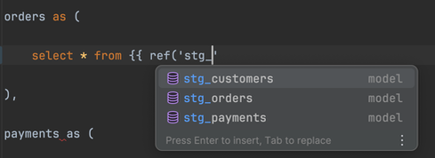
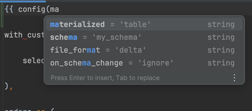
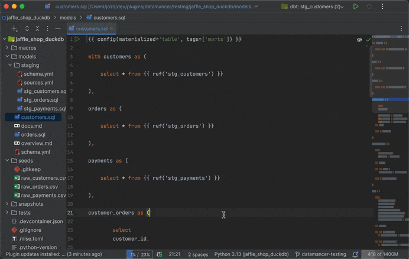
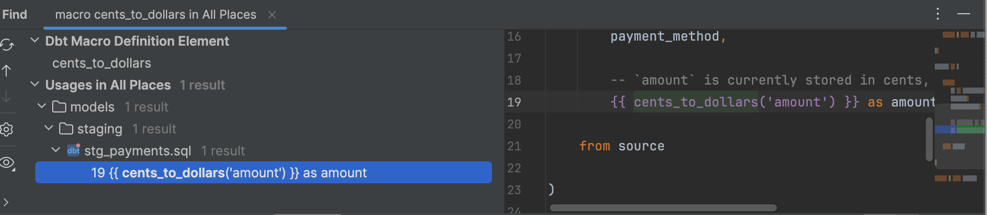
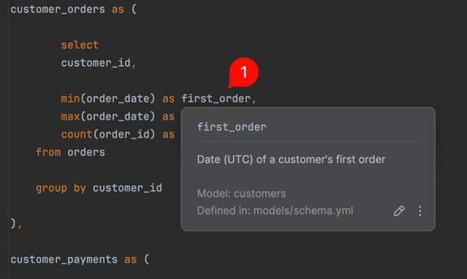
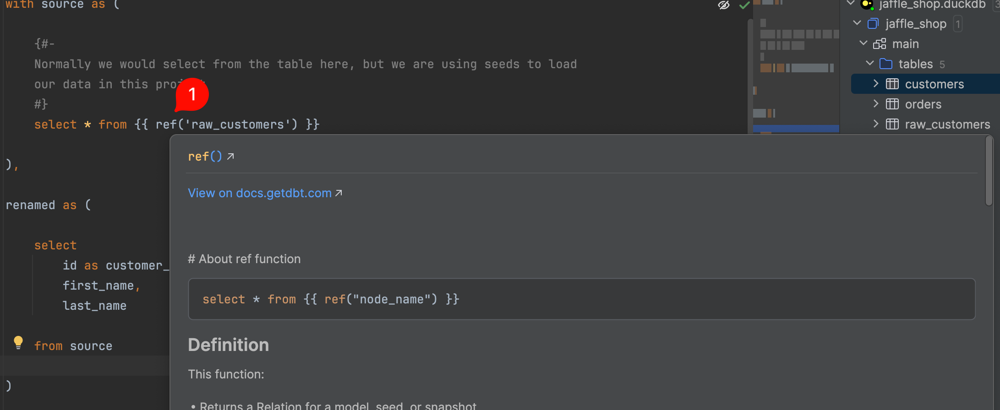
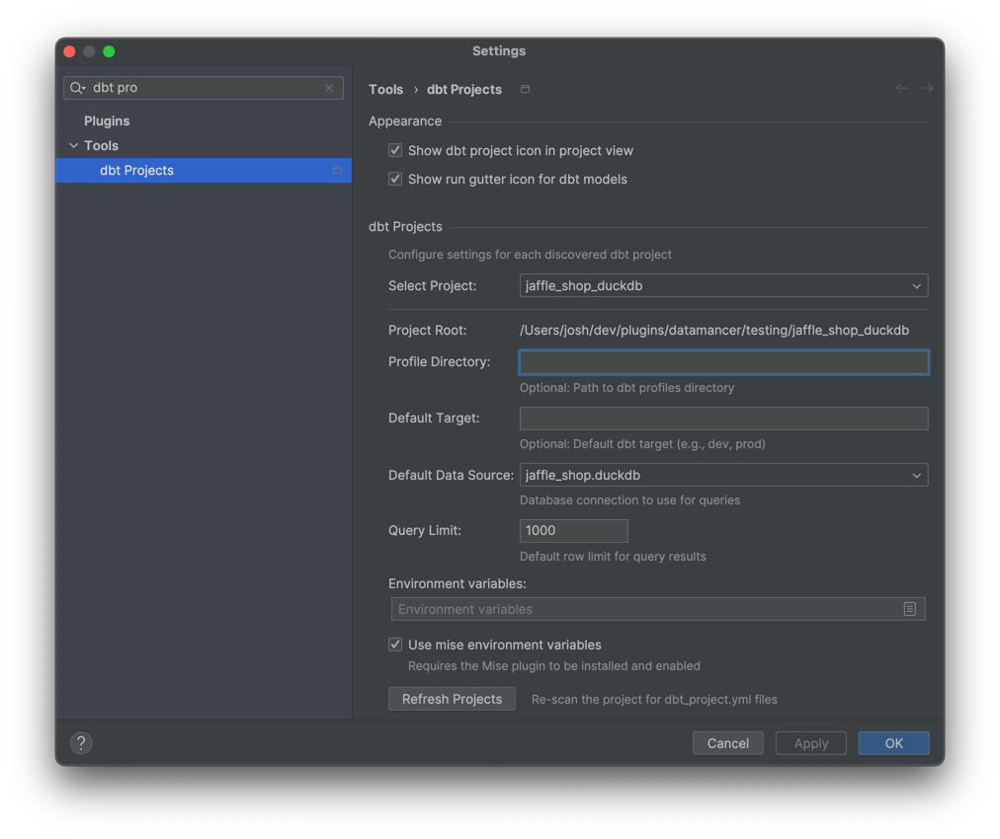
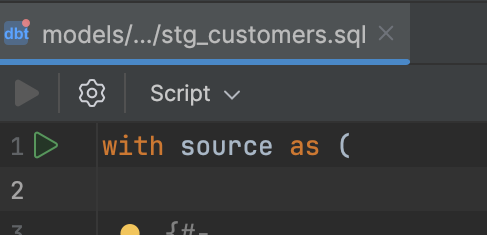
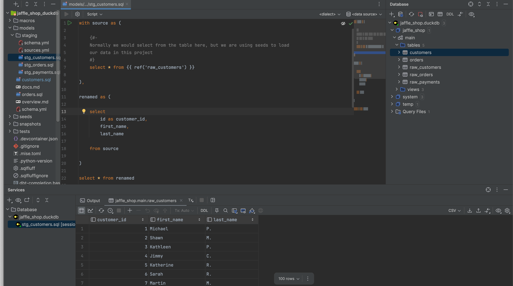
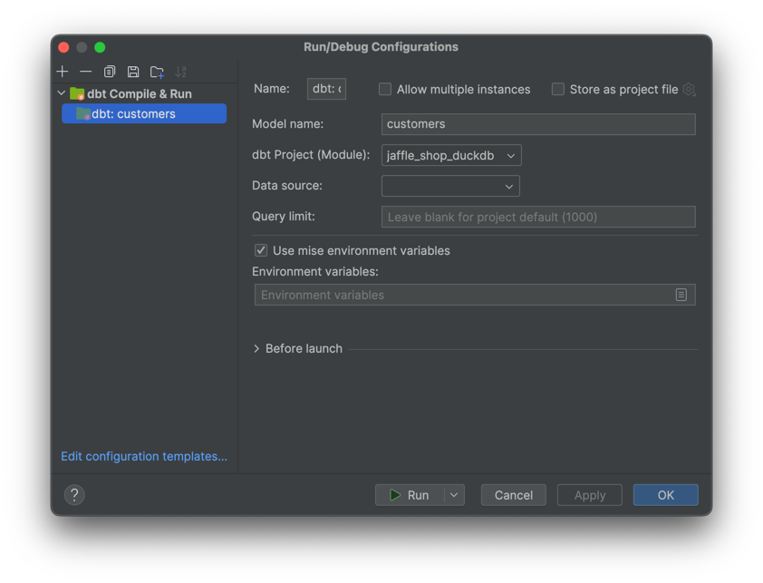

# Datamancer

Datamancer turns PyCharm and IntelliJ IDEA (and other JetBrains IDEs) into a first-class [dbt Core](https://www.getdbt.com/) development environment. It adds Jinja2-aware go-to-definition, code completion, find usages, documentation, and much, much more to SQL & YAML files in dbt projects.

The plugin automatically discovers `dbt_project.yml` files when you open a project and activates dbt-specific features for files within that project's directory. Multi-project workspaces (monorepos with multiple dbt projects) are fully supported.

> [!IMPORTANT]
> NOTE: DUE TO NO Jinja2 support in DataGrip, Datamancer's features are only available in PyCharm and IntelliJ.

## Features (Core)

The core plugin is focused on enhancing the editing experience for both dbt Core and dbt Fusion projects, with features like navigation, code completion, documentation, and project discovery.

Compilation and execution features are provided by the separate `Datamancer - dbt Core Backend` plugin/`Datamancer - dbt Fusion Backend` plugin, installing one of those backends is recommended to get the full experience,
but the core plugin can be used on its own if you only want the editing features without compilation/execution.

> Note Datamancer is incompatible with the official JetBrains dbt plugin (`org.jetbrains.dbt`). You must uninstall it before using Datamancer.

### Automatic Project Discovery

Datamancer scans your project for `dbt_project.yml` files on startup and automatically activates IDE features for any SQL files within those dbt project directories. SQL files are treated as Jinja2 templates with SQL as the outer language, giving you full Jinja2 support without any manual configuration.

If you add or remove dbt projects, use the "Refresh Projects" button in Settings -> Tools -> dbt Projects to re-scan.

### Code Completion

Context-aware code completion throughout your dbt project:

- Model names inside `ref()` calls, suggesting model SQL files in the project.
- Source names (first argument) and table names (second argument) inside `source()` calls.
- Variable names inside `var()` calls.
- `config()` keyword arguments with descriptions.
- dbt Jinja2 tags and context variables including `ref`, `source`, `var`, `env_var`, `run_query`, `this`, `target`, `adapter`, `config`, `model`, `schema`, `execute`, `flags`, `graph`, and more.
- SQL column names from referenced models (parses the last SELECT statement in the model file) and from CSV seed file headers.

### Navigation (Go-to-Definition)

With SQL files, and YAML files, full Go-to-Definition support for dbt constructs:

`Ctrl+Click` (`Cmd+Click` on macOS) on dbt references to navigate directly to their definitions:

- `ref('model_name')` -> navigates to the model's `.sql` file.
- `source('source_name', 'table_name')` -> navigates to the source definition in YAML schema files, or the seed CSV file.
- `var('variable_name')` -> navigates to the variable definition in `dbt_project.yml`
- `{{ my_macro() }}` -> navigates to the macro definition in `.sql` files under `/macros/` (and `Find Usages` shows all macro calls across the project)
- YAML schema files -> `CMD+Click` on model names to navigate to their SQL files, on source/table names to navigate to their definitions, and on column names to navigate to their occurrences in the parent model's SQL.
- SQL model files -> a gutter icon navigates to the model's YAML schema definition (also available via Navigate -> Go to YAML Definition).

### Column Documentation (Quick Doc)

Hover over a column name in a dbt SQL model file (or press `Ctrl+Q` / `Cmd+Q`) to see its documentation. The popup displays:

- Column description from the YAML schema file
- Data type from the compiled manifest (when available)
- Model name and which schema file the column is defined in

The popup includes a "Jump to Source" action (pencil icon) that navigates directly to the column's definition in the YAML schema file.

### Find Usages

Find all usages of dbt models, sources, and macros across your project:

- Place the cursor on a model name in a `ref()` call or on the model file itself, and use Find Usages (Alt+F7 / Cmd+Option+F7) to see every `ref()` call that references it
- Works for sources referenced via `source()` calls as well
- Place the cursor on a macro definition to find all calls to that macro across the project

### Rename Refactoring

Rename a dbt model SQL file using the IDE's rename refactoring (Shift+F6), and all `ref()` calls that reference that model are automatically updated to use the new name.

### Jinja2 Language Support

SQL files in dbt projects get full Jinja2 template language support:

- Jinja2 syntax highlighting within SQL files
- Brace matching for `{{ }}`, ``, parentheses, and square brackets
- Automatic quote completion inside Jinja2 function calls
- Smart SQL parsing that understands which Jinja2 expressions produce SQL output (`ref()`, `source()`, `var()`) versus those that don't (`config()`, setup macros), so the SQL parser does not report false errors

### dbt Documentation

Hovering over dbt functions like `ref()`, `source()`, `var()`, and `config()` in SQL files shows a documentation popup with descriptions of the function and its arguments. The documentation is sourced from the official dbt documentation.

Hovering over custom macro calls (e.g. `{{ my_macro() }}`) shows the macro's signature with parameters and the source file where it is defined.

Documentation is also provided for `dbt_utils` package functions (e.g. `dbt_utils.generate_surrogate_key()`).

### Project Settings

Configure each dbt project individually via Settings -> Tools -> dbt Projects:

- Profile directory - path to your `profiles.yml`
- Default target - the dbt target to use (e.g. `dev`, `prod`)
- Data source - IntelliJ database connection for query execution
- Query limit - maximum number of rows returned when executing queries
- Environment variables - custom environment variables passed to the dbt process
- Backend selection - choose between dbt Core and dbt Fusion backends

### File Icons

Custom file icons help you identify dbt files at a glance in the project view:

- dbt SQL model files display a distinct dbt file icon
- dbt project root directories display a dbt project icon
- Both light and dark theme variants are included

> This setting can be configured in `Settings | Tools | dbt Projects` -> `Show dbt project icon in project view`.

### Compile and Execute

With the Datamancer - dbt Core Backend plugin installed, you can compile and execute dbt models directly from the IDE:

- Compile dbt models via the dbt CLI using the project's configured Python interpreter
- Execute the compiled SQL against a configured database data source through IntelliJ's Database Tools
- Gutter run icons appear on dbt model SQL files in the `/models/` directory for one-click compile and execute
- Right-click a model file to auto-generate a "dbt Compile & Run" run configuration, which can be saved and reused from the Run menu

The backend automatically loads your project's `target/manifest.json` and watches it for changes. When the manifest is available, column documentation popups include data types and compiled SQL from the manifest. Running `dbt compile` externally will automatically update the plugin's cached metadata.

### Mise support

Integration with [intellij-mise](https://github.com/134130/intellij-mise) provides support for using mise environment variables within Run Configurations and other
tooling.

This can be set on a project level and on a per-Run Configuration basis.

## Plugins

Datamancer is split into three independently-installable plugins:

| Plugin | What it provides | Required? |
|--------|-----------------|-----------|
| Datamancer | Navigation, completion, find usages, rename refactoring, project discovery, settings | Yes |
| Datamancer - dbt Core Backend | Compilation via dbt CLI, query execution, run configurations, gutter run icons, manifest-powered column/macro documentation | dbt Core |
| Datamancer - dbt Fusion Backend | Compilation and execution via dbt Fusion LSP | dbt Fusion (Coming soon) |

Both backends can be installed at the same time. You can select which backend to use per-project in the settings panel.

## Requirements

- IDE: PyCharm Professional 2025.3.2+ or IntelliJ IDEA Ultimate 2026.1+. The community edition doesn't have Jinja2 support.
- dbt project: A project containing a `dbt_project.yml` file
- For compilation and execution: A Python interpreter with `dbt-core` installed and configured in the IDE
- For query execution: A database data source configured in IntelliJ's Database Tools
- Not compatible with the official JetBrains dbt plugin (`org.jetbrains.dbt`). Uninstall it before installing Datamancer.

> Community Edition IDEs are not supported. Datamancer requires the Database Tools and Python plugins, which are only available in Professional and Ultimate editions.

## Installation

Datamancer is not yet published on the JetBrains Marketplace. To install manually:

1. Download the plugin ZIP files from [GitHub Releases](https://github.com/joshuataylor/datamancer/releases)
2. In your IDE, go to Settings -> Plugins -> gear icon -> Install Plugin from Disk...
3. Select the Datamancer (core) ZIP file and click OK
4. Repeat for the Datamancer - dbt Core Backend ZIP file
5. Restart the IDE

JetBrains Marketplace publication is planned.

## Getting Started

1. Install the Datamancer plugins (see [Installation](#installation))
2. Open a project that contains a `dbt_project.yml` file
3. Wait for the IDE to finish indexing. Datamancer activates after indexing completes.
4. Open a model SQL file. You should see Jinja2 syntax highlighting in your dbt template expressions.
5. Type `{{ ref('` inside a SQL file to see model name completions
6. Ctrl+Click (Cmd+Click on macOS) on a `ref('model_name')` call to navigate to the model file
7. To enable compilation and execution, configure a data source in Settings -> Tools -> dbt Projects
8. Click the green run icon in the gutter of a model file to compile and execute it

## Troubleshooting

If something is not working as expected, you can collect diagnostic information:

- Go to Tools -> Datamancer Debug (or press Ctrl+Alt+Shift+D)
- This writes a `datamancer-debug.txt` file to your project root with information from all Datamancer services
- Include this file when reporting issues

## Contributing

Contributions are welcome. See:

- [CONTRIBUTING.md](CONTRIBUTING.md) for development setup and guidelines

To report bugs or request features, open an issue on [GitHub](https://github.com/joshuataylor/datamancer/issues).

## Licence

Licensed under the Apache Licence, Version 2.0. See [LICENCE](LICENCE) for details.
